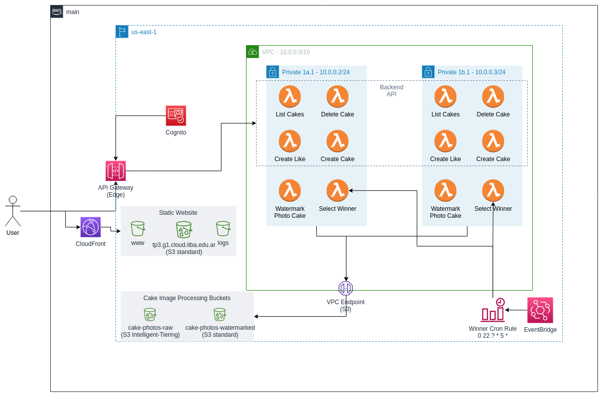

# TP3 - Grupo 1

Este proyecto de Terraform permite levantar la infraestructura parcial para soportar el proyecto de la panadería "El Hornero".

## Integrantes

| Alumno                 | Legajo | Participacion |
| ---------------------- | ------ | ------------- |
| Suárez Bodean, Joaquin | 54361  | 50%           |
| Reyes, Santiago        | 58148  | 50%           |
| Rolandelli, Alejandro  | 56644  | 0%            |
| Nuñez Kohler, Damián   | 54365  | 0%            |

## Arquitectura

## Servicios

- Api Gateway
- EventBridge
- Cognito
- Lambda
- Cloudfront
- S3 Buckets

## Funciones de Terraform

`sha1` y `jsonencode` fueron utilizadas en conjunto para detectar cambios de contenido en la API para así realizar un deploy.

## Meta-argumentos

El `for_each` se utilizó para:

- Facilitar la creación de lambdas que siguen un patrón claro como pueden ser las lambdas asociadas a los endpoints de API Gataway.

El `lifecycle` se utilizó para:

- Evitar borrar el bucket de imágenes de fotos procesadas ya que sería un problema de gran importancia para el negocio perder estos datos.
- Para crear un nuevo deployment previo borrado del deployment antiguo en API Gateway.

El `depends_on` se utilizó para:

- Asegurarse de que el VPC Endpoint esté activo previa creación de las lambdas que interactúan con S3.
